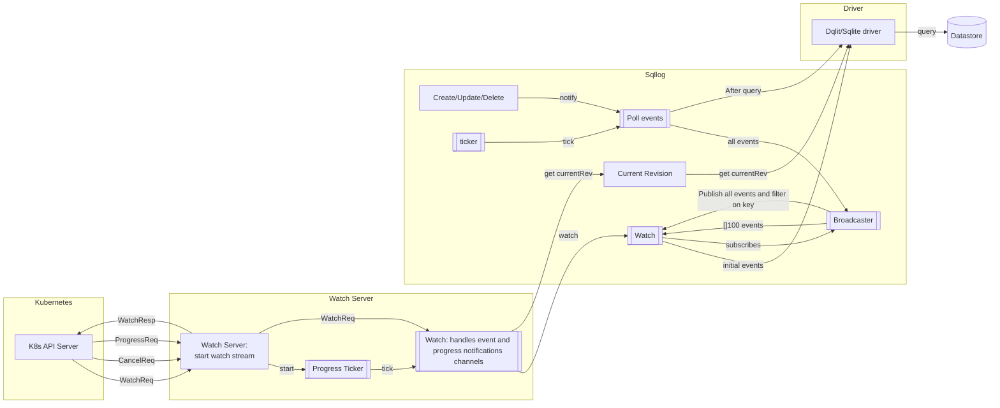
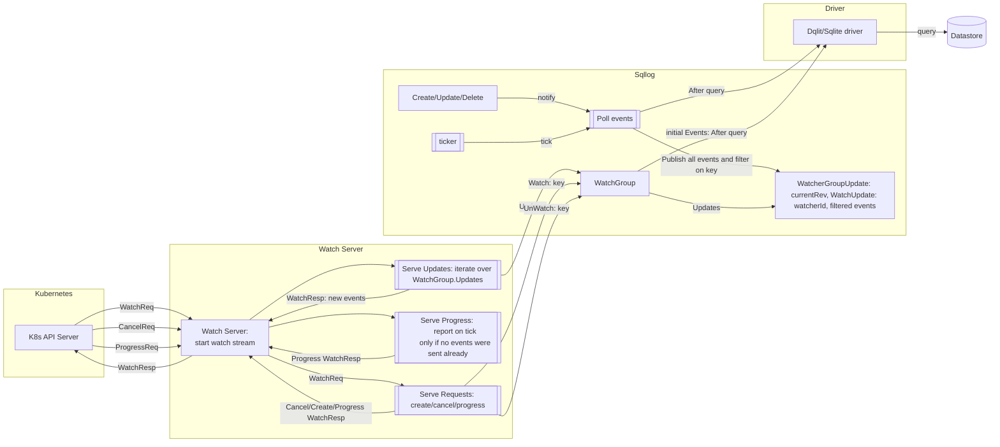

# 002 Watch Synchronization

Status:  Accepted

Date: 2025-04-04

Tags: watch, synchronization, architecture

## Context

**Problem Statement:** We need to ensure that the watch synchronization mechanism in our system is efficient, effective and reliable.

**Previous Implementation (Brief):** The previous implementation handling Kubernetes watch events inherited from Kine was not designed
for a single synchronization point of all watch streams. The system used a broadcaster to manage watch stream subscriptions and forward
events from a poll loop. It follows the fan-out and fan-in Go pattern for distributing the watch events to the watchers which in turn
send the watched events to the API server. After the WatchList feature in Kubernetes upstream required an additional watch progress
notification, instead of re-implementing the watchers a fix was made on top of the existing event implementation. This fix introduces
a blocking wait point to get all watchers synced to the same revision.
An issue with a missing event caused us to revisit the implementation and the ultimate inefficiency caused us to re-write the
watch implementation.

This diagram illustrates the previous architecture:

**Limitations of the Previous Implementation:** An issue with a missing event caused us to revisit the implementation as
the "current revision" from the datastore was not in sync with the current revision from the event poll. The biggest
issue with the implementation was the inefficient wait after the fan-out and fan-in of events that was introduced to get
all watchers synchronized to the same point.

**New Requirement:** Implement a robust synchronization mechanism to ensure all watchers are aligned to the same "current
revision" for accurate progress notifications to the Kubernetes API server.

## Decision

We will implement a WatcherGroup interface to manage watchers dynamically and ensure that all watchers within the group
remain synchronized to the same "current revision". This approach removes the previous broadcaster component and avoids
unnecessary event reordering associated with fan-out/fan-in patterns. We will also remove the sequentializing of events
and filling of event gaps, which were specific requirements for PostgreSQL in kine.

This flow diagram illustrates the new architecture:

## Consequences

**Positive:**

* Improved synchronization of watch events, leading to accurate progress notifications.
* Ensures the Kubernetes API server can correctly validate its watcher cache.
* Simplifies the event flow by removing the broadcaster and unnecessary fan-in/fan-out.
* Removes the complexity of sequentializing events and filling gaps, potentially improving performance and reducing code complexity.

**Negative:**

* Could not optimize the watch query (yet) as the TTL implementation depends on the watch implementation

## Considered Options

* **Previous Implementation (with Broadcaster):** Retain the existing architecture.
  * **Pros:** Already implemented.
  * **Cons:** Suffered from synchronization issues and required a complex event flow. Did not support watch progress notifications.
* **Rejected Approach: Event Fan-In with Blocking Synchronization:** Forwarding events directly to watchers and attempting synchronization during fan-in using blocking mechanisms.
  * **Pros:** Removed the broadcaster.
  * **Cons:** Proved inefficient due to the need for blocking to create an artificial synchronization point.
* **Final Approach: WatcherGroup-Based Synchronization:** (The chosen decision, described above).

## Pros and Cons of the Decision (WatcherGroup-Based Synchronization)

* **Pros:**
  * Ensures consistent "current revision" across all watchers in the group.
  * Enables accurate progress notifications to the Kubernetes API server.
  * Simplifies the event processing pipeline.
  * Avoids unnecessary event reordering and gap filling.
  * Improves maintainability by removing the complex broadcaster component.
* **Cons:**
  * Large architectural change that requires thorough testing efforts in order to avoid introduction of bugs into our product.

## Links

K8s-dqlite PRs:

* bug: fix missing event by rm broadcaster and implementing WatchGroups  [PR](https://github.com/canonical/k8s-dqlite/pull/264)
* Use watch poll Rev as "current rev" for watch progress [PR](https://github.com/canonical/k8s-dqlite/pull/263)
* Watch Progress Request [PR](https://github.com/canonical/k8s-dqlite/pull/212)

Kine References:

* Fix multiple issues with Watch [PR](https://github.com/k3s-io/kine/pull/238)
* Add ProgressNotify support [PR](https://github.com/k3s-io/kine/pull/251)
* Add support for WatchProgressRequest [PR](https://github.com/k3s-io/kine/pull/268)
* Return an emulated etcd version in the status endpoint [PR](https://github.com/k3s-io/kine/pull/316)

## Notes

Upstream features supported by the synchronization point:

* **ConsistentListFromCache**: Enhance Kubernetes API server performance by serving consistent list requests directly from its watch cache, improving scalability and response times.
* **WatchList**: Enable support for streaming initial state of objects in watch requests.
