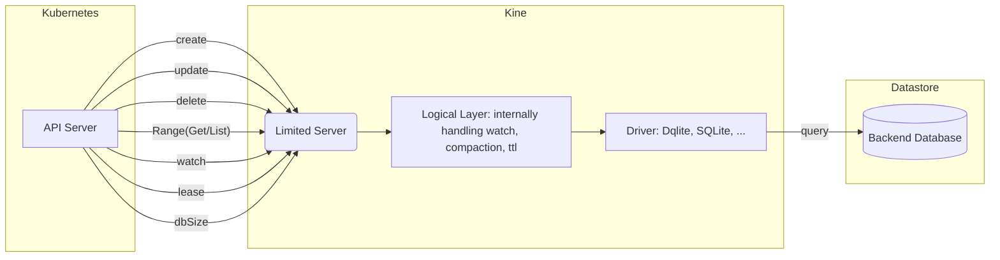

# Architecture

K8s-dqlite is a translation layer between the Kubernetes API server and the Dqlite database. K8s-dqlite is a project forked from kine which is a replacement for the etcd3 datastore.

## Architecture Diagram

The architecture of k8s-dqlite is designed to provide a seamless integration between the Kubernetes API server and the Dqlite database.

The Kubernetes API server sends requests to k8s-dqlite’s limited server. Since the datastore does not handle watchers and leases natively the logical layer introduces logic to handle this internally. Lastly, the requests flow through the driver which tweaks a few configurations based on the implementation's datastore choice before sending the query to the datastore backend.

