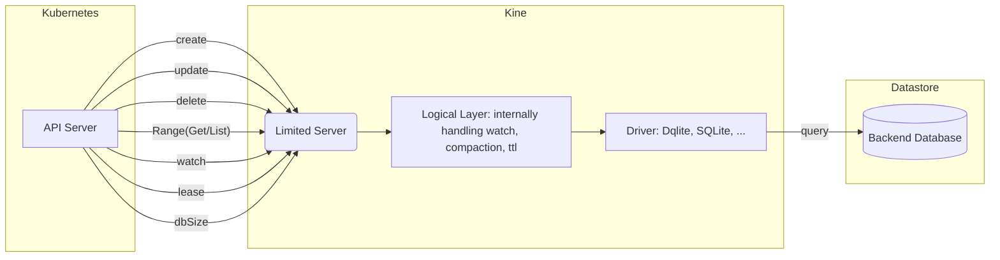

# Architecture

K8s-dqlite is a translation layer between the Kubernetes API server and the [Dqlite](https://dqlite.io/) database. K8s-dqlite is a project forked from kine which is a replacement for the etcd3 datastore. The project is designed to provide a seamless integration between the Kubernetes API server storage interface and the Dqlite database.

## Upstream Kubernetes API server storage interface

The upstream [kubernetes API server](https://kubernetes.io/docs/reference/command-line-tools-reference/kube-apiserver/) currently only supports etcd3 natively. The API server’s  [storage interface](https://pkg.go.dev/k8s.io/apiserver/pkg/storage#Interface) is still coupled to the etcd3.store. This is mainly due to the Watch implementation which is tailored to etcd. The main responsibilities of the kubernetes API server storage interface  include the management of Key-Value (KV) pairs (creating, updating and deleting them) and (fetching, listing, counting and watching them). Furthermore, the datastore is expected to remove keys if a time-to-live is specified.

## Parent Project: Kine

Kine serves both as a translation layer of the Kubernetes API server requests tailored for etcd and as a logical layer that implements features supported by etcd natively but not by the SQL backends (mysql, nats, pgsql, sqlite). An example here would be the management of compaction or the watcher and time-to-live (ttl) implementation. This logical layer has no “fine-tuning” to optimize it for the datastore backend.

Kine supports a subset of API server requests (create, update, delete, range(get, list), database compaction and ttl. Kine tries to use a generic template to forward the requests  to the datastore. A little bit of tuning is done for each database driver.

The kine repo is mostly maintained by a sole-contributer working for Rancher/SUSE. The project has recently removed the support of the k8s-dqlite driver.

See kine’s [flow diagram](https://github.com/k3s-io/kine/blob/master/docs/flow.md) for a more detailed view.

## Project history of K8s-dqlite

[Canonical/kine](https://github.com/canonical/kine) is a fork of kine diverging from upstream since 2019. In 2021 we started our own repo k8s-dqlite. Most of the work added to the repos were backports from kine. We began pro-actively maintaining the repo in 2024.
Taking ownership of the repo has allowed us to strip k8s-dqlite of the “baggage” introduced for the support of kine’s other backends and optimize the implementation for Dqlite. These improvements touch both the logical layer and the drivers. For instance we’ve optimized the queries for our Dqlite backend and introduced batching for write transactions and compaction. In the logical layer we’ve re-implemented the watcher and the compaction.

## High-level architecture diagram

The architecture of k8s-dqlite is designed to provide a seamless integration between the Kubernetes API server and the Dqlite database.

The Kubernetes API server sends requests to k8s-dqlite’s limited server. Since the datastore does not handle watchers and leases natively the logical layer introduces logic to handle this internally. Lastly, the requests flow through the driver which tweaks a few configurations based on the implementation's datastore choice before sending the query to the datastore backend.

### Simplified architecture diagram

## Logical layer

The logical layer is responsible for implementing the features that are not natively supported by Dqlite. This includes the watcher, compaction, and time-to-live (TTL) management.

### Time-To-Live (TTL)

One of the main inefficiencies in k8s-dqlite is the TTL implementation. While etcd supports lease management natively, Dqlite does not. The current implementation downloads the entire database on startup and listens to all changes. Future work should add a second table to handle leases and implement the etcd lease model. Another specification is planned to define this work.

### Watcher

The watcher logic has been replaced by us, introducing more efficient watch streaming and synchronization of events needed for watch progress notifications and removing technical debt inherited from kine. Since the TTL implementation is tightly coupled with the watcher we have not been able to improve the watch query itself yet. Another specification is planned to define this work.

### Compaction

Upstream Kubernetes requires a limited time window of deleted events to be stored in the database. The compaction logic in k8s-dqlite is responsible for marking key-value pairs as deleted and eventually removing them entirely once they pass out of the event history time window.

The compaction logic has been re-implemented to be more efficient and to better suit the needs of Dqlite. The new implementation uses batching for the deletion of rows and performs it on a single-node, which reduces the amount of data that needs to be processed and improves performance.
